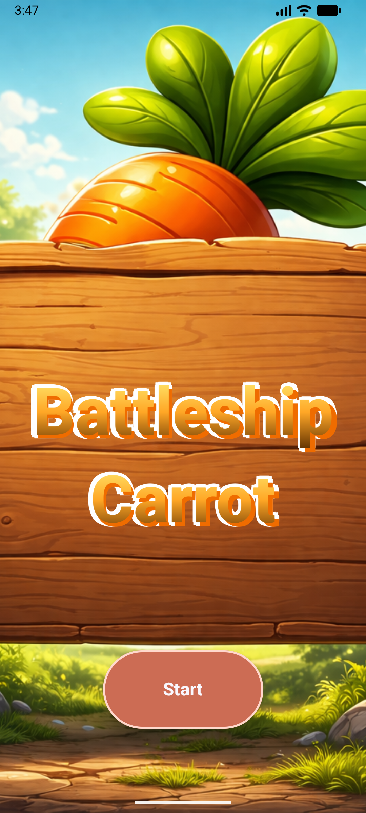
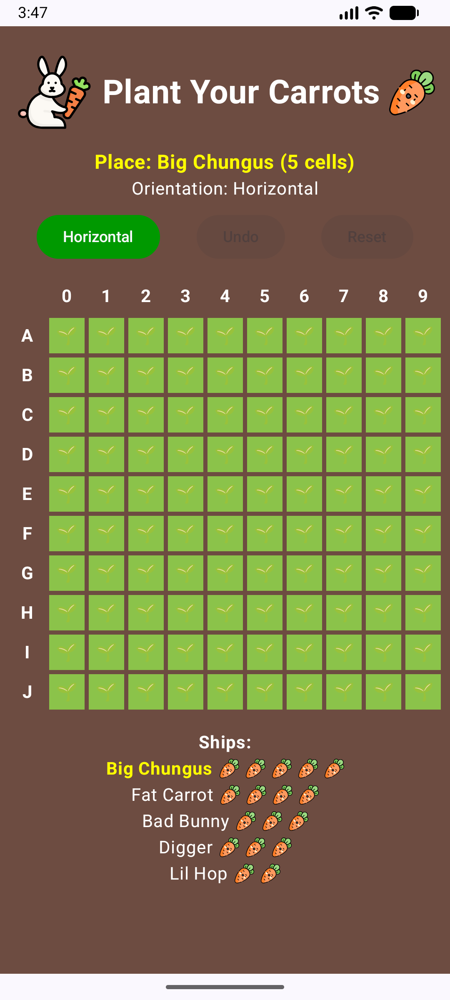
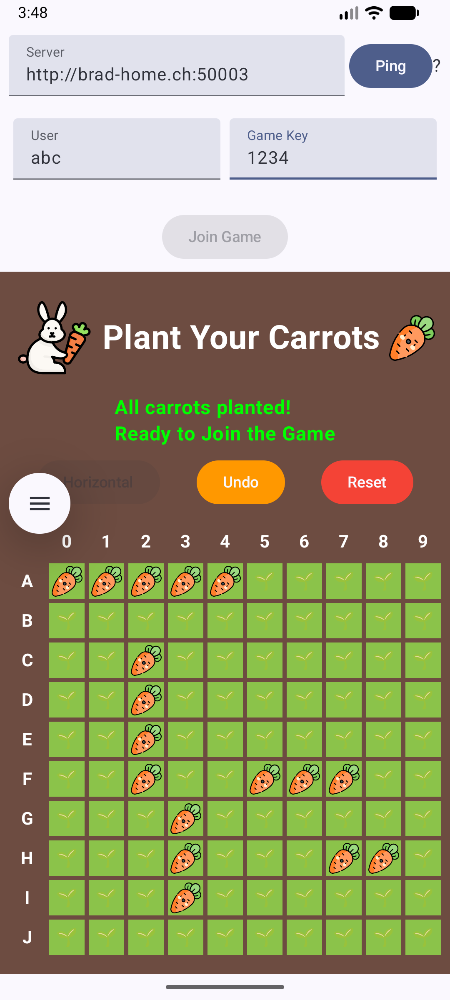
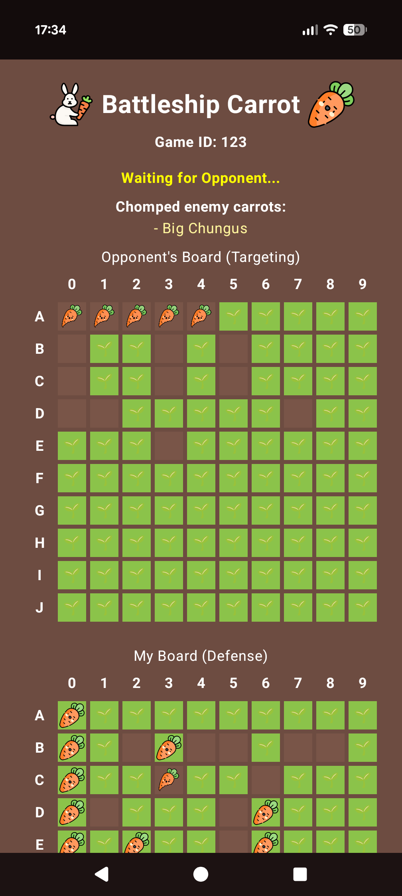
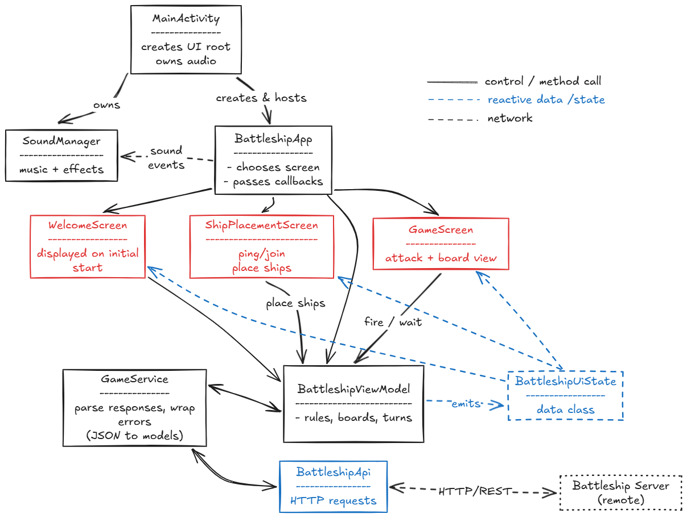
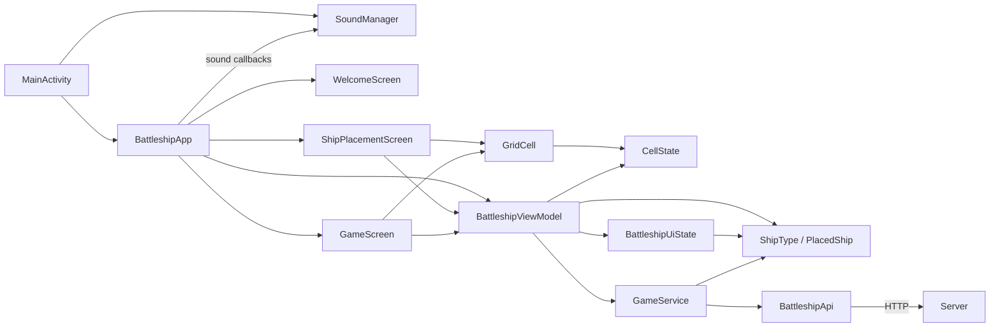
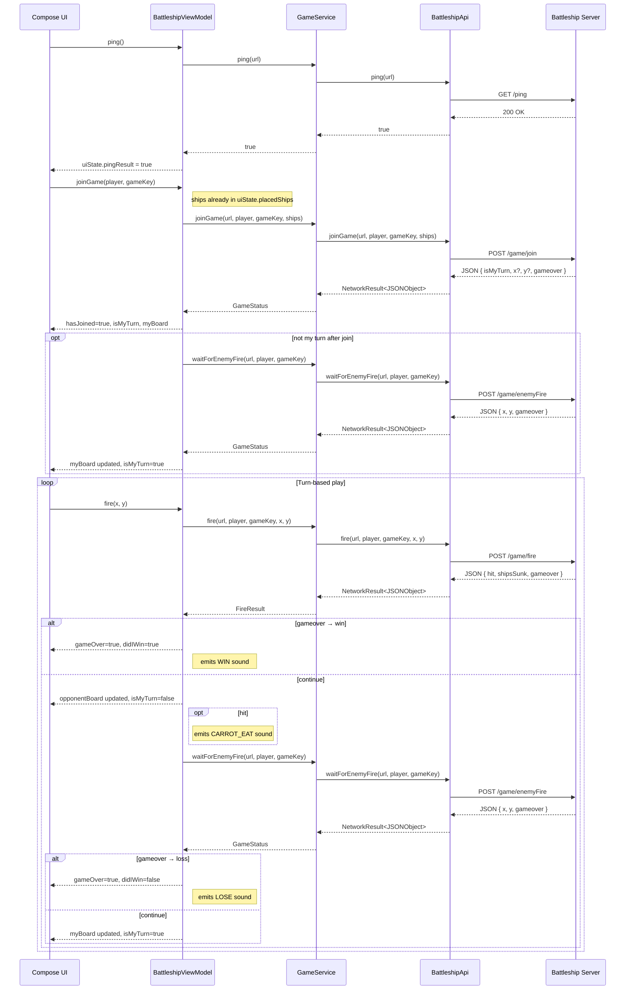
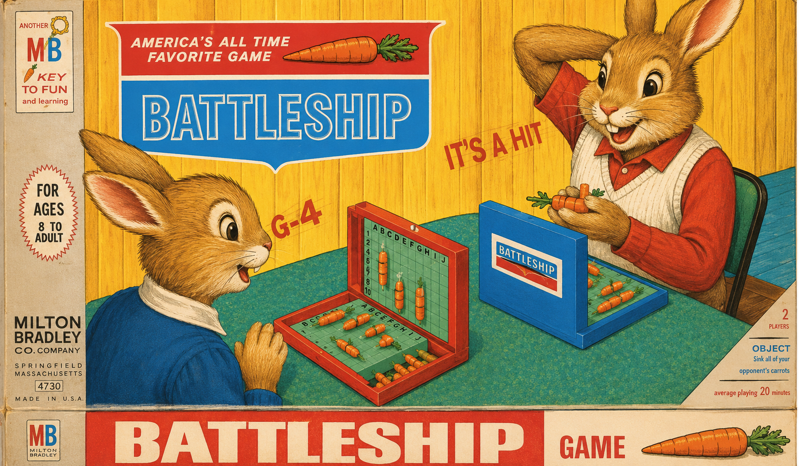

# Battleship Carrot

**Author:** Noor Vinnai  
**Course:** 26FS Mobile Applications with Android

This is my student project submission for the Android course. The project is an Android client for a multiplayer Battleship game, themed around rabbits and carrots. The course was around Easter, that's why I went with the playful rabbit/carrot theme instead of the classic naval one.

Battleship Carrot is an Android client for a multiplayer Battleship game built with **Kotlin** and **Jetpack Compose**. The project keeps the classic Battleship rules, but swaps the naval theme for a rabbit-and-carrot theme: ships become named carrots, the UI uses playful graphics, and the game includes themed sound effects for attacks, hits, wins, and losses.

The App was developed in Android Studio Panda (2025.3.4), and needs `minSdk = 27`, targets `targetSdk = 36`.

The client handles:

- the full ship placement flow
- validation for illegal placements
- server connection and join requests
- turn-based firing against the enemy board
- receiving enemy shots from the backend
- end-of-game feedback with themed audio

## User interface and flow

### 1. Welcome screen

The first screen is the app start screen, which has a single Start button:

### 2. Ship placement screen

After starting, the player enters the placement phase. This is where the carrot "fleet" is planted into a **10x10 board**.

The placement screen shows:

- the current carrot/ship that must be placed next
- its required length
- the current orientation
- the board with row labels **A-J** and column labels **0-9**
- action buttons for **Horizontal/Vertical**, **Undo**, and **Reset**

Placement is validated before a ship is accepted. The app blocks placements that:

- go outside the board
- overlap with already placed ships

If a placement is invalid, an error message is shown.

### 3. Connection and join flow

Once all ships are placed, the app unlocks the connection controls at the top of the screen. The player can then:

1. enter or change the backend server address
2. ping the server to check whether it is reachable
3. enter a player name and game key, minimum length of 3 characters is validated for both fields in the client
4. join a match

If the request succeeds, the player enters the game screen. If it fails, the app stays on the current screen and shows the backend error message.

### 4. Game screen

During the match, the player sees:

- the current game ID
- a status message that shows whether it is the player's turn, the app is firing, or it is waiting for the opponent
- a list of enemy ships already sunk (list of carrots chomped)
- the opponent board used for targeting
- the player's own board used as the defense board at the bottom

When it is the player's turn, they can tap a cell on the opponent board to fire. When it is not their turn, the app waits for the backend to report the enemy move.

When the game ends, the app displays a **You Won!** or **You Lost!** banner and plays the matching sound.

Gameplay screen on Google Pixel 9 Pro XL

## Running the project

The application can be run on an Android emulator or a physical device, after the gradle project is imported in Android Studio.

Current default DEFAULT_BASE_URL is set to "http://brad-home.ch:50003", but it can be changed in-game.

## Architecture and structure

Architecturally, the app follows a **single-activity, multiple-screens** structure. The `MainActivity` hosts the entire app and manages the lifecycle for audio playback.

(diagram made in excalidraw)

### Component dependencies

The main components and their dependencies are shown in the diagram below. 

The app follows an **MVVM-style structure**:

- **Compose UI** renders the screens and forwards user actions
- **ViewModel** owns the game state and game rules
- **Service/API layer** talks to the backend and maps JSON into app-friendly models
- **Audio layer** handles background music and sound effects

This split keeps the screen composables relatively focused on presentation, while the gameplay logic stays  in `BattleshipViewModel`.

### Sequence diagram for the main flows of the app, from pinging the server to joining a game and firing turns:

## File overview

`*` = `app/src/main/java/ch/fhnw/vinnai/`

| Path | Responsibility |
| --- | --- |
| `*/battleshipclient/MainActivity.kt` | Android entry point; instantiates `BattleshipViewModel` and `SoundManager`, passes sound callbacks (dig, carrot-eat, win, lose) to `BattleshipApp`, and forwards `onStart`/`onStop`/`onDestroy` to `SoundManager` |
| `*/battleshipclient/BattleshipApp.kt` | Root Compose function; hosts `WelcomeScreen`, `ServerBar`, and `JoinBar`; routes to `ShipPlacementScreen` or `GameScreen`; observes `pendingSoundEffect` on the ViewModel and fires the sound callbacks received from `MainActivity` |
| `*/battleshipclient/viewmodel/BattleshipViewModel.kt` | Core game logic and state owner; manages all three 10×10 boards (`placementBoard`, `myBoard`, `opponentBoard`); handles placement validation (bounds and overlap), join/fire/enemy-fire coroutine flows, URL normalisation, and sound effect emission |
| `*/battleshipclient/viewmodel/BattleshipUiState.kt` | Immutable data class with all UI-facing state: server URL, ping result, turn flags, join/loading status, win/loss result, sunk ship list, placed ships, current ship index, orientation, and placement error message |
| `*/battleshipclient/view/ShipPlacementScreen.kt` | Placement UI; renders the 10×10 grid via `PlacementBoardView`, shows current ship info, and provides orientation toggle, undo, and reset buttons alongside a ship list summary with carrot icons |
| `*/battleshipclient/view/GameScreen.kt` | Match UI; renders the opponent targeting board and own defense board via `BoardView`, the game-over banner, turn status text, and the sunk-enemy-ships list |
| `*/battleshipclient/view/GridCell.kt` | Single board cell composable; renders `EMPTY` (🌱), `SHIP` (carrot image), `HIT` (eaten-carrot image), and `MISS` (brown background) states with a click-enabled guard |
| `*/battleshipclient/view/CellState.kt` | Enum for the four board cell states: `EMPTY`, `SHIP`, `HIT`, `MISS`; used by all three board arrays and `GridCell` |
| `*/battleshipclient/view/ShipType.kt` | `ShipType` enum (Carrier → PatrolBoat, each with `size` and `displayName`) and `PlacedShip` data class (position, orientation, `occupiedCells()`) |
| `*/battleshipclient/service/BattleshipApi.kt` | Low-level HTTP client; makes `GET /ping` and `POST /game/join\|fire\|enemyFire` requests via `HttpURLConnection`; returns `NetworkResult<JSONObject>` |
| `*/battleshipclient/service/GameService.kt` | Delegates to `BattleshipApi` and maps raw `JSONObject` responses into `GameStatus`, `FireResult`, and `BoardShot`; resolves backend ship names to themed display names |
| `*/battleshipclient/audio/SoundManager.kt` | Looping background music (`MediaPlayer`), dig and carrot-eat effects (`SoundPool`), and win/lose one-shot sounds (`MediaPlayer`); tied to the activity lifecycle via `resume`/`pause`/`release` |

## Game rules implemented in the client

The client implements usage for all APIs of the server.  
Rules enforced:

- Board size is **10x10**
- Rows are labeled **A-J**
- Columns are labeled **0-9**
- Every ship must be placed before joining a game
- Ships cannot overlap
- Ships cannot extend outside the board
- The player can only fire when `isMyTurn` is true
- The player cannot fire twice at the same target cell
- The game ends when the backend reports game over

Each board cell is represented by one of four states:

| State | Meaning |
| --- | --- |
| `EMPTY` | Nothing placed or no shot taken yet |
| `SHIP` | A player ship occupies the cell |
| `HIT` | A shot hit a ship |
| `MISS` | A shot landed on an empty cell |

These states are used across placement, defense, and targeting boards.

## Carrot fleet

The project replaces classic ship names with carrot themed names:

| Ship in code | Name shown in app | Size |
| --- | --- | ---: |
| `Carrier` | Big Chungus | 5 |
| `Battleship` | Fat Carrot | 4 |
| `Destroyer` | Bad Bunny | 3 |
| `Submarine` | Digger | 3 |
| `PatrolBoat` | Lil Hop | 2 |

## State and flow

The ViewModel drives the app through three main phases:

1. **Placement** - the user places all ships on `placementBoard`
2. **Joined game** - the placement board is copied to `myBoard`, and the client joins a backend match
3. **Turn-based play** - the user attacks through `opponentBoard` while enemy shots are applied to `myBoard`

Important state is stored in `BattleshipUiState` includes:

- server and ping information
- current turn state
- join/loading status
- win/loss state
- sunk enemy ships
- placed ship list
- current ship index and orientation
- placement error messages

Alongside that UI state, the ViewModel also manages three 10x10 board structures:

- `placementBoard`
- `myBoard`
- `opponentBoard`

That separation is useful because the general UI state describes the phase of the game, while the board arrays hold the frequently changing cell values.

## Backend communication

The client expects a compatible Battleship server and communicates with these endpoints:

| Method | Endpoint | Purpose |
| --- | --- | --- |
| `GET` | `/ping` | Check whether the server is reachable |
| `POST` | `/game/join` | Join a match with player name, game key, and ship placement |
| `POST` | `/game/fire` | Fire at the opponent board |
| `POST` | `/game/enemyFire` | Wait for and receive the enemy move |

### Data sent by the client

When joining a game, the client sends:

- player name
- game key
- the full fleet with coordinates and orientation

When firing, the client sends:

- player name
- game key
- target `x`
- target `y`

### Data used by the client

The service layer converts backend JSON into:

- `GameStatus`
- `FireResult`
- `BoardShot`

This keeps raw JSON handling out of the UI layer.

## Audio

The app includes:

- looping background music
- a digging sound when the player attacks
- a carrot-eating sound when a hit lands
- separate win and lose sounds

Audio playback is managed by `SoundManager`, which is started, paused, and released together with the Android activity lifecycle.
The SoundManager implementation was created with the help of GitHub Copilot Plan mode, it helped me understand how the sound loop works, and also why the background music quality was crispy in the beginning.

## Tests

The application was tested in an Android emulator and on a physical device (Google Pixel 9 Pro XL) to verify the UI and flows. The was tested against a local server and the remote server at `http://brad-home.ch:50003` as well.

The repository includes unit and integration tests across three test classes:

### `PlacedShipTest`

Unit tests for `PlacedShip.occupiedCells()`:

| Test | Checks |
| --- | --- |
| `occupiedCells returns horizontal coordinates in order` | A horizontal `Destroyer` at (2,4) produces cells (2,4), (3,4), (4,4) |
| `occupiedCells returns vertical coordinates in order` | A vertical `PatrolBoat` at (7,1) produces cells (7,1), (7,2) |

### `BattleshipViewModelTest`

Unit tests for the placement flow and input validation in `BattleshipViewModel`:

| Test | Checks |
| --- | --- |
| `placeShipAt marks cells and advances to next ship` | Valid placement sets `SHIP` state on the correct board cells and increments `currentShipIndex` |
| `placeShipAt rejects out of bounds placement` | A ship that would extend outside the 10×10 grid is rejected with an error message |
| `placeShipAt rejects overlap with existing ship` | A ship placed on already-occupied cells is rejected with an overlap error |
| `undoLastShip removes ship cells and rewinds placement progress` | Undo clears the cells and decrements `currentShipIndex` |
| `resetPlacement clears board and placement state` | Reset sets all placed cells back to `EMPTY` and resets `currentShipIndex` to 0 |
| `toggleOrientation flips horizontal flag` | Calling `toggleOrientation()` inverts `uiState.isHorizontal` |
| `updateServerBaseUrl normalizes valid url and resets ping result` | A URL with leading/trailing spaces and a trailing slash is trimmed, stored, and `pingResult` is cleared |
| `updateServerBaseUrl rejects invalid url` | A bare hostname without a scheme is rejected with `"Invalid server URL"` and `pingResult = false` |

### `GameServiceIntegrationTest`

Integration tests for `GameService` against a `MockWebServer` (OkHttp):

| Test | Checks |
| --- | --- |
| `joinGame posts ships and maps game status response` | A mocked `/game/join` response with `x`, `y`, and `gameover` fields is correctly mapped to a `GameStatus` with `BoardShot(4, 7)` and `gameOver = false` |
| `fire posts target and maps sunk ships response` | A mocked `/game/fire` response maps `hit`, `gameover`, and `shipsSunk` (raw server names `Destroyer`/`PatrolBoat`) to themed display names `Bad Bunny`/`Lil Hop` in `FireResult` |

## Credits

- Sound effects: Pixabay / freesound_community and floraphonic
- Audio edited with Audacity
- Welcome screen background created with ChatGPT

---

